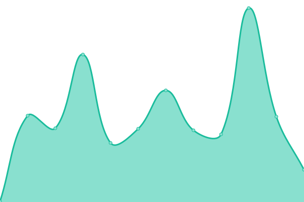

# [📈 Live Status](https://TeamHema.github.io/leadminer-status): <!--live status--> **🟩 All systems operational**

This repository contains the open-source uptime monitor and status page for [TeamHema](https://TeamHema.github.io/leadminer-status), powered by [Upptime](https://github.com/upptime/upptime).

With [Upptime](https://upptime.js.org), you can get your own unlimited and free uptime monitor and status page, powered entirely by a GitHub repository. We use [Issues](https://github.com/TeamHema/leadminer-status/issues) as incident reports, [Actions](https://github.com/TeamHema/leadminer-status/actions) as uptime monitors, and [Pages](https://TeamHema.github.io/leadminer-status) for the status page.

<!--start: status pages-->
<!-- This summary is generated by Upptime (https://github.com/upptime/upptime) -->
<!-- Do not edit this manually, your changes will be overwritten -->
<!-- prettier-ignore -->
| URL | Status | History | Response Time | Uptime |
| --- | ------ | ------- | ------------- | ------ |
|  [LeadsMiner Frontend](https://www.leadsminer.app/) | 🟩 Up | [leads-miner-frontend.yml](https://github.com/TeamHema/leadminer-status/commits/HEAD/history/leads-miner-frontend.yml) | 

 508ms
     
 | 

<a href="https://TeamHema.github.io/leadminer-status/history/leads-miner-frontend">100.00%</a>
    

|  [LeadGen API (Primary Backend)](https://leadgen-api.fly.dev/healthz) | 🟩 Up | [lead-gen-api-primary-backend.yml](https://github.com/TeamHema/leadminer-status/commits/HEAD/history/lead-gen-api-primary-backend.yml) | 

 174ms
     
 | 

<a href="https://TeamHema.github.io/leadminer-status/history/lead-gen-api-primary-backend">100.00%</a>
    

|  [ClickHouse Database](https://clickhouse-fly-leadminer-prod.fly.dev/) | 🟩 Up | [click-house-database.yml](https://github.com/TeamHema/leadminer-status/commits/HEAD/history/click-house-database.yml) | 

 796ms
     
 | 

<a href="https://TeamHema.github.io/leadminer-status/history/click-house-database">100.00%</a>
    

<!--end: status pages-->

[**Visit our status website →**](https://TeamHema.github.io/leadminer-status)

## 📄 License

- Powered by: [Upptime](https://github.com/upptime/upptime)
- Code: [MIT](./LICENSE) © [Anand Chowdhary](https://anandchowdhary.com), supported by [Pabio](https://pabio.com)
- Data in the `./history` directory: [Open Database License](https://opendatacommons.org/licenses/odbl/1-0/)
